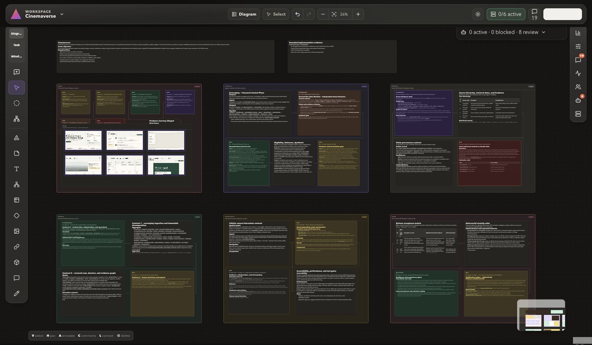

# Guild

**A multiplayer visual workspace where people and local AI workers build software together.**

[Open Guild](https://guild-rose-two.vercel.app) · [MIT License](./LICENSE)




Guild gives humans and AI workers one shared project surface. Product briefs, architecture,
flows, designs, implementation tasks, comments, progress, evidence, and decisions live on a
realtime infinite canvas instead of being scattered across chat threads and disconnected tools.

Humans remain in control. They choose teams, start or stop work, inspect results, give precise
feedback, approve revisions, and undo changes. AI execution happens through a paired local Guild
Runner using already authenticated Codex CLI or Claude Code sessions. Guild Cloud coordinates the
work but performs no model inference and stores no provider API keys.

## Why Guild exists

AI coding tools are productive inside individual prompts, but software projects need durable shared
context. Requirements change, several specialists work at once, outputs overlap, and human decisions
must remain visible. Traditional chat interfaces make that coordination difficult to inspect.

Guild turns the project itself into the coordination layer:

- people and AI workers read and update the same canvas;
- each workstream has an explicit owner, scope, status, and region;
- agent actions produce visible, attributable changes rather than hidden chat output;
- comments can target a workspace, section, object, or exact hosted-design coordinate;
- revisions, evidence, conflicts, and approval state remain connected to their source;
- local execution keeps model credentials and repository access on the user's computer;
- WebMCP lets a browser agent operate the product through structured tools.

## Product capabilities

### Realtime project canvas

Guild provides a shared infinite canvas with Diagram, Task, and Wireframe modes. The canvas supports
dragging, resizing, multi-select, semantic connectors, minimap navigation, zoom, presentation views,
search, comments, activity, and live collaborator presence.

Fifteen neutral object types cover product and engineering work without forcing a rigid methodology:

`shape`, `sticky`, `text`, `mindMapNode`, `table`, `icon`, `image`, `link`, `section`,
`annotation`, `drawing`, `task`, `stack`, `wireframeFrame`, and `wireframeComponent`.

Objects can carry structured semantics such as project area, priority, status, owner, and stable
logical key. Edges describe relationships including `contains`, `informs`, `requires`, `implements`,
`supports`, `depends_on`, `calls`, `reads_from`, `writes_to`, `emits`, `triggers`, `verified_by`,
`blocks`, and `supersedes`.

### Role Profiles, Teams, Runs, and Jobs

A Role Profile defines one reusable AI responsibility: name, instructions, engine, color, expected
outputs, and optional owned canvas section. Role Profiles can be saved as Teams and launched together
through a Team Run.

Every Run creates deterministic Jobs. Guild exposes queued, leased, running, dependency-blocked,
completed, failed, cancelled, and waiting-for-Runner states without inventing model progress. Each
Job retains its role, engine, dependencies, attempt number, target region, progress receipts, and
resulting object IDs.

### Human feedback and revision control

Comments can remain notes or be routed to the responsible workstream. Visual feedback supports exact
canvas targets and immutable hosted-design references, including route, viewport, scroll position,
and normalized point or rectangle coordinates.

Grouped feedback dispatch preserves every comment while creating at most one revision Job per owner.
Design revisions remain immutable. Humans can compare revisions, request changes, approve a version,
or restore an older version by creating a new revision.

### Hosted design review

Guild can publish a hosted product preview as a versioned design set. The system stores deployment
identity and screen metadata, validates approved origins, captures desktop and mobile screens through
the local Runner, and projects them into the canvas. Raw HTML, browser cookies, and image bytes never
travel through WebMCP tool arguments.

### Implementation tasks and evidence

Canvas tasks can be listed, claimed, and completed through WebMCP. External workstreams can report
bounded progress independently from Runner Jobs. Implementation evidence records changed files,
checks, commits, pull requests, and hosted previews with explicit provenance and link-verification
state. Reported evidence is not treated as proof until its corresponding check exists.

### Conflict-aware history and undo

Canvas writes are grouped into Change Sets. Content, geometry, style, semantics, and hierarchy use
independent revisions, so concurrent work conflicts only when it touches the same segment. Team Runs
can be undone through a compensating Change Set while preserving later, unrelated human edits.

## WebMCP integration

Guild registers 25 page-defined tools through `document.modelContext.registerTool`. A compatible
browser agent can discover these tools from the live application and operate the same authenticated
state as the visible interface.

| Area                 | Tools                                                                                                                                  |
| -------------------- | -------------------------------------------------------------------------------------------------------------------------------------- |
| Workspace inspection | `list_workspaces`, `get_workspace_context`, `search_canvas`                                                                            |
| Canvas and feedback  | `apply_canvas_changes`, `add_comment`, `dispatch_feedback_batch`                                                                       |
| Teams and execution  | `run_ai_team`, `get_run_status`, `get_runner_status`, `stop_run`, `retry_job`, `undo_run`                                              |
| Implementation tasks | `list_implementation_tasks`, `claim_task`, `report_task_result`                                                                        |
| Hosted designs       | `publish_design_preview`, `get_design_set`, `get_design_revision_status`                                                               |
| External workstreams | `register_workstream`, `report_workstream_update`, `complete_workstream`, `get_workstream_feedback`, `acknowledge_workstream_feedback` |
| Evidence             | `report_implementation_evidence`, `list_implementation_evidence`                                                                       |

Tool inputs use strict JSON schemas. Reads require workspace membership. Mutations enforce role-based
authorization, idempotency keys, revision expectations, workspace boundaries, and allowed values.
Viewer accounts can inspect shared context but cannot modify it.

WebMCP controls Guild; it does not run a hosted model. Team execution stays delegated to the local
Runner.

## Architecture

```text
Compatible browser + WebMCP agent
                 │
                 ▼
       Next.js application
       WorkOS AuthKit session
                 │
                 ▼
      Convex realtime backend
  canvas · comments · runs · history
                 │
       short-lived job capability
       lease · attempt · fencing token
                 ▼
        Local Guild Runner
          ├── Codex CLI
          └── Claude Code
```

### Web application

The Next.js application renders the landing page, authenticated workspace list, infinite canvas,
focus views, feedback controls, Team Run controls, Runner pairing, presence, and WebMCP registry.
WorkOS AuthKit supplies authentication. Convex subscriptions keep users, objects, Runs, comments,
and Worker progress synchronized in realtime.

### Convex control plane

Convex stores workspace membership, canvas objects and bodies, semantic edges, comments, Change Sets,
activity, presence, Role Profiles, Teams, Runs, Jobs, Runner leases, Work Claims, reservations,
design revisions, visual anchors, external workstreams, and implementation evidence.

Server mutations enforce authorization and concurrency. Job scheduling is durable and deterministic;
late writes from expired or superseded attempts are rejected.

### Local Guild Runner

The Runner is a separate Bun/Node process intended for macOS. It pairs with Guild through a one-time
browser approval, stores its long-lived token in macOS Keychain, reports installed engines, polls for
eligible Jobs, and launches bounded local worker processes.

Each worker receives:

- one assignment and bounded workspace digest;
- only the environment variables it needs;
- a short-lived assignment capability;
- assignment-scoped MCP tools;
- a Work Claim and collision-free Reserved Region;
- output, timeout, cancellation, and redaction limits.

Provider credentials, local filesystem credentials, executable paths, and full process environments
are never sent to Guild Cloud.

### Shared protocol package

`@guild/protocol` contains the schemas and invariants shared by the web application and Runner:
canvas commands, limits, stable keys, feedback payloads, design publications, evidence records,
workstream updates, URL policy, hashes, progress states, and error contracts.

## Safety and trust model

- **Local inference:** Guild Cloud stores coordination state but performs no model inference.
- **No provider API keys in cloud:** Runner uses existing local Codex CLI or Claude Code sessions.
- **Role-based access:** workspace reads and writes are checked server-side.
- **Bounded capabilities:** each Job receives a short-lived token scoped to one workspace and attempt.
- **Work Claims:** workers can modify only their assigned targets and permitted relationships.
- **Reserved Regions:** concurrent workers receive non-overlapping canvas bounds.
- **Fencing:** attempt numbers and fencing tokens reject stale subprocess writes.
- **Idempotency:** repeated commands replay safely; changed payloads cannot reuse an existing key.
- **Segment revisions:** concurrent content, geometry, style, semantics, and hierarchy updates conflict
  independently.
- **Secret redaction:** Runner output is bounded and scrubbed before progress reaches the cloud.
- **Safe preview capture:** hosted origins and redirects are validated before local capture.
- **Reversible changes:** Change Sets and conflict-aware undo preserve later unrelated edits.

## Technology stack

| Layer            | Technology                                          |
| ---------------- | --------------------------------------------------- |
| Application      | Next.js 16, React 19, TypeScript                    |
| Canvas           | React Flow / `@xyflow/react`, Zustand               |
| Backend          | Convex realtime database and functions              |
| Authentication   | WorkOS AuthKit                                      |
| WebMCP           | `document.modelContext`, Zod-generated JSON schemas |
| Local execution  | Bun, Node.js, Codex CLI, Claude Code                |
| Local MCP bridge | Model Context Protocol TypeScript SDK               |
| Styling          | Tailwind CSS 4                                      |
| Testing          | Vitest, Testing Library, Playwright, axe-core       |
| Hosting          | Vercel with Convex Cloud                            |

## Repository structure

```text
guild/
├── convex/                 Backend schema, queries, mutations, scheduling, and auth
├── packages/
│   ├── guild-protocol/     Shared schemas, limits, keys, and contracts
│   └── runner/             Local Runner CLI, engine adapters, MCP bridge, and capture
├── public/                 Static browser assets and preview bridge
├── src/
│   ├── app/                Next.js routes and Runner HTTP endpoints
│   ├── components/         Canvas, focus, feedback, and workspace UI
│   ├── domain/             Pure domain rules and projections
│   ├── features/           Canvas state, WebMCP, Runner, focus, and workspace integration
│   └── server/             Server-only authorization and Runner helpers
├── skills/                 Browser-controller and bounded-worker operating protocols
├── tests/                  Domain, component, integration, Runner, WebMCP, and E2E tests
├── .env.example            Environment variable template without secrets
├── convex.json             Convex and WorkOS integration configuration
├── vercel.json             Production hosting configuration
└── package.json            Workspace scripts and pinned runtime versions
```

## Local development

### Requirements

- Bun 1.3.9
- Node.js 24
- Convex project
- WorkOS account and AuthKit application

### Install

```bash
git clone https://github.com/AvichalDwivedi2205/guild.git
cd guild
bun install --frozen-lockfile
cp .env.example .env.local
```

Configure `.env.local`:

```dotenv
NEXT_PUBLIC_CONVEX_URL=https://your-deployment.convex.cloud
WORKOS_CLIENT_ID=client_your_client_id
WORKOS_API_KEY=sk_test_your_key
WORKOS_COOKIE_PASSWORD=replace_with_at_least_32_random_characters
NEXT_PUBLIC_WORKOS_REDIRECT_URI=http://localhost:3000/callback
WORKOS_JWT_ISSUER=https://api.workos.com/user_management/client_default_application
```

Never commit `.env.local` or real secret values.

### Start the application

```bash
bunx convex dev
bun run dev
```

Open [http://localhost:3000](http://localhost:3000).

`bun run dev`, `bun run build`, and `bun run check` build `@guild/protocol` automatically.

## Pair and run the local Worker service

Build the Runner, start pairing, approve the displayed request in the browser, then start polling:

```bash
bun run runner:build
node packages/runner/dist/cli.js login \
  --cloud-url http://localhost:3000 \
  --runner-name "My Mac"
node packages/runner/dist/cli.js start
```

Codex CLI or Claude Code must already be installed and authenticated locally. The Runner reports
which engines are ready and exposes truthful waiting state when it is offline or at capacity.

## Quality checks

```bash
bun run check
bun run runner:test
bun run runner:build
bun run build
bun run test:e2e
```

| Command                      | Purpose                                                               |
| ---------------------------- | --------------------------------------------------------------------- |
| `bun run format:check`       | Check Prettier formatting                                             |
| `bun run lint`               | Run ESLint with zero warnings allowed                                 |
| `bun run typecheck`          | Run strict application TypeScript checks                              |
| `bun run test`               | Run domain, component, integration, WebMCP, and Runner-adjacent tests |
| `bun run protocol:typecheck` | Type-check shared protocol package                                    |
| `bun run runner:typecheck`   | Type-check local Runner                                               |
| `bun run test:e2e`           | Run Chromium desktop/mobile flows                                     |
| `bun run check`              | Run main repository quality gate                                      |

Authenticated end-to-end tests additionally use untracked storage state and workspace environment
variables. Do not commit browser sessions or test credentials.

## Deployment

Guild is configured for Vercel and Convex Cloud:

1. Create production Convex and WorkOS environments.
2. configure the production variables listed in `.env.example`.
3. deploy Convex functions and schema.
4. deploy the Next.js application to Vercel.
5. set the production AuthKit callback URL to `/callback` on the deployed origin.
6. pair at least one local Runner with the intended workspaces when AI execution is required.

The landing page can render without live Convex and WorkOS values. Authentication, workspaces,
realtime canvas data, and Runner operations require configured production services.

## License

Guild is open source under the [MIT License](./LICENSE).
